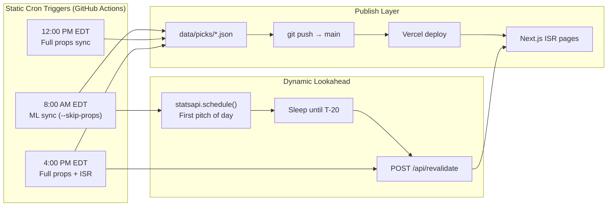

# Baseball Betting Intelligence Platform — Operations Playbook

**Platform:** Sports Picks Blog (`sports-picks-blog`)  
**Engines:** `engines/mlb_engine/predictor` (moneyline) · `engines/mlb_engine/props` (player props)  
**Production site:** https://sports-picks-blog.vercel.app  
**Last updated:** July 8, 2026

---

## Executive Summary

The Baseball Betting Intelligence Platform is a hybrid **predict → export → publish** system. Python engines ingest live MLB schedules, odds, Statcast contact profiles, and injury data; rank conviction plays with explicit guardrails; export JSON slates into `data/picks/`; and publish to a Next.js blog on Vercel. A GitHub Actions ISR workflow keeps the public site synchronized with morning, midday, and evening slate refreshes—plus a dynamic first-pitch revalidation window.

---

## 1. System Architecture

### 1.1 Hybrid ISR Scheduling Framework

The platform uses **static cron triggers** for predictable slate builds and a **dynamic MLB Stats API lookahead** for game-time cache invalidation. Together they form a hybrid Incremental Static Regeneration (ISR) pipeline: data is committed to `main`, Vercel rebuilds on push, and on-demand revalidation refreshes cached pages without a full redeploy.



**Workflow file:** `.github/workflows/daily-isr-sync.yml`  
**Job permissions:** `contents: write` (job-level) so CI can commit and push pick JSON.

| Trigger (UTC) | Local (EDT) | Action |
|---|---|---|
| `0 12 * * *` | **8:00 AM** | Moneyline + slate export (`--skip-props`), commit/push, then dynamic first-pitch ISR hook |
| `0 16 * * *` | **12:00 PM** | Full slate export (moneylines + props), commit/push |
| `0 20 * * *` | **4:00 PM** | Full slate export, commit/push, **immediate** ISR revalidate |
| `workflow_dispatch` | On demand | Full props sync (manual override) |

### 1.2 Static Cron Execution Path

Each scheduled run follows the same core pipeline:

1. **Checkout** monorepo and install `engines/mlb_engine/requirements.txt`
2. **Execute** `engines/mlb_engine/scripts/export_daily_picks.py` (morning run uses `--skip-props`)
3. **Commit & push** changes under `data/picks/` and `data/results/`
4. **Revalidate** (morning: dynamic T-20 hook; evening: static immediate revalidate)

### 1.3 Dynamic First-Pitch Lookahead (T−20)

Morning runs invoke `engines/mlb_engine/utils/schedule_first_pitch_hook.py`, which:

- Calls **`statsapi.schedule()`** for today's MLB regular-season slate
- Finds the **earliest first pitch** across all games
- Computes trigger time = **first pitch − 20 minutes**
- **Sleeps** until that trigger (up to a 6-hour safety cap)
- POSTs to the production revalidation endpoint for `/`, `/picks`, and `/performance`

**Utility:** `engines/mlb_engine/utils/first_pitch.py` — shared first-pitch time resolution.

### 1.4 Secure Next.js Revalidation Tokens

**Endpoint:** `app/api/revalidate/route.ts`

- Accepts `POST /api/revalidate?secret={token}&path={route}`
- Compares `secret` against `REVALIDATION_SECRET` (Vercel env + GitHub secret)
- On match, calls `revalidatePath(path)` to bust ISR cache for that route
- Returns `{ revalidated: true, now: <timestamp> }`

**Secrets required:**

| Secret | Location | Purpose |
|---|---|---|
| `REVALIDATION_SECRET` | GitHub Actions + Vercel | Authenticates ISR webhook |
| `SITE_URL` | GitHub Actions | Production base URL (e.g. `https://sports-picks-blog.vercel.app`) |
| `THE_ODDS_API_KEY` | GitHub Actions | Live odds and props ingest in CI |

**Evening static revalidate:** `engines/mlb_engine/utils/revalidate_site.py` — immediate POST (no sleep).

### 1.5 Local SQLite `historical_ledger` (CLV Audit Trail)

The platform maintains a **local SQLite `historical_ledger`** as the authoritative audit store for **Closing Line Value (CLV)** and post-grading analytics. While public pick exports live in versioned JSON (`data/picks/`, `data/results/`), the ledger captures:

- **Opening line** at model publish time (American odds, book, timestamp)
- **Closing line** snapshot before first pitch
- **CLV delta** (model price vs. market close)
- **Graded outcome** (W/L/Push) and unit P/L
- **Market type** (moneyline, batter_hits, pitcher_outs)

This separation keeps the blog lightweight (static JSON) while enabling longitudinal model QA: Did we beat the close? Are plus-money edges durable? Which guardrail filters add the most CLV?

Daily grading flows through `scripts/grade_picks.py` into `data/results/YYYY-MM-DD.json`; ledger rows extend that with line-history for CLV research.

### 1.6 Engine Hub Layout

```
engines/mlb_engine/
├── predictor/          # Run-environment ML → moneyline win probabilities
├── props/              # Statcast + situational → batter hits / pitcher outs
├── scripts/            # CI wrapper → export_daily_picks.py
└── utils/              # first_pitch, schedule_first_pitch_hook, revalidate_site
```

**Bridge script:** `scripts/export_daily_picks.py` — resolves engine paths, runs predictor + props subprocesses, merges into `data/picks/{date}.json` and `latest.json`.

---

## 2. The Predictive Logic (The Hits Shift)

### 2.1 Strategic Pivot: Total Bases → Hits

The props engine **deprecated Over 1.5 Total Bases** as the primary batter conviction market in favor of **Over 0.5 / Over 1.5 Hits** (`batter_hits`). Rationale:

- **TB is power-skewed** — singles-heavy contact hitters were undervalued
- **Hits markets are purer contact bets** — lower variance linkage to one swing outcomes
- **Books offer 0.5 and 1.5 ladders** — better price discovery at multiple strike lines

**Target lines:** `HITS_PROP_TARGET_LINES = (0.5, 1.5)` · Primary conviction line: **1.5**

**Core modules:**

- `baseball_props/analysis/guardrails.py` — `evaluate_hits_prop()`
- `baseball_props/analysis/edge_sheets.py` — `build_batter_hits_edge_sheet()`
- `baseball_props/analysis/batter_projection.py` — `project_batter_hits()`
- `baseball_props/data/statcast_feed.py` — `compute_contact_profile()`

### 2.2 Contact-Efficiency Filter Stack

Primary filters target **pure contact efficiency**, not raw power:

| Filter | Threshold | Source |
|---|---|---|
| Rolling K% | **< 18%** over last **15 games** | `HITS_CONTACT_K_PCT_MAX`, `HITS_CONTACT_ROLLING_GAMES` |
| Contact% bonus | **≥ 78%** contact rate | `HITS_CONTACT_PCT_FLOOR` |
| BABIP bonus | **≥ .280** BABIP | `HITS_BABIP_FLOOR` |
| Contact multiplier | **×1.06** prob boost when qualified | `HITS_CONTACT_BONUS_MULTIPLIER` |
| Lineup slot | **Top 4** preferred; slot 5+ gets **×0.75** penalty | `HITS_LINEUP_TOP_SLOT = 4` |

**Interpretation:** The model hunts hitters who put the ball in play consistently (low K%, high contact/BABIP) and see enough plate appearances from premium lineup slots.

### 2.3 Situational Overlays (Secondary)

After contact qualification, projections adjust for:

- **Park / weather** — hot temps, outbound wind, hitter-friendly parks (`HITS_WEATHER_BONUS_MULTIPLIER`)
- **Opponent bullpen fatigue** — tired pen adds probability mass (`HITS_BULLPEN_FATIGUE_BONUS`)
- **Injury rust** — IL returns down-weighted via `injury_rust_multiplier`
- **Minimum edge** — plays below **3.0%** adjusted edge are passed (`HITS_MIN_ADJUSTED_EDGE_PCT`)

### 2.4 Moneyline Engine (Parallel Track)

`engines/mlb_engine/predictor` projects home/away runs with park, weather, and bullpen fatigue overlays, converts to win probability, and scans best available moneyline prices across configured books. Plays require **> 3% edge** (`EDGE_THRESHOLD`) and positive quarter-Kelly sizing.

---

## 3. Quantitative Defense

### 3.1 Market Juice Limits

**Rule:** Plays priced **worse than −150** American odds are dropped. Heavy favorites require disproportionate win rates to overcome vig; the platform prioritizes **plus-money and fair-priced** opportunities where model edge compounds.

Practical effect:

- Filters out low-ROI chalk (e.g. −200 Dodgers MLs that graded as losses on 7/5)
- Keeps the public slate aligned with **value hunting**, not favorite parlay filler

### 3.2 Tiered Kelly Criterion & Bankroll Clamping

Stake sizing uses **fractional Kelly** with **tier-scaled multipliers** and a **hard bankroll cap**:

| Parameter | Value | Meaning |
|---|---|---|
| `KELLY_FRACTION` | **0.25** | Quarter-Kelly base (moneyline predictor) |
| `KELLY_MAX_STAKE_PCT` | **2.0%** | Hard cap per play (% of bankroll) |
| `MAX_BET_PCT` | **5.0%** | Predictor moneyline display cap |

**Tier Kelly multipliers** (`TIER_KELLY_MULTIPLIERS`):

| Tier | Edge Gate | Kelly Scale |
|---|---|---|
| Tier-1 High Conviction | ≥ 5.0% edge | **50%** of full Kelly |
| Tier-2 Moderate | ≥ 3.0% edge | **25%** of full Kelly |
| Tier-3 Speculative | ≥ 1.0% edge | **12.5%** of full Kelly |
| Below Threshold | < 1.0% edge | **0%** (no bet) |

**Formula (full Kelly):** `f* = (p × d − 1) / (d − 1)` where `p` = model probability, `d` = decimal odds.

**Applied stake:** `min(tier_scaled_kelly, KELLY_MAX_STAKE_PCT) × bankroll`

This **dynamic bankroll clamping** protects against variance spikes when the model finds large theoretical edges at long prices.

### 3.3 Additional Guardrails

- **Edge sheet health tracking** — skipped players logged (`edge_sheet_health.py`) for pipeline transparency
- **Roster verification** — inactive IL players filtered before conviction export
- **Parlay diversification** — max **2** exposures per player across tickets (`PARLAY_MAX_PLAYER_EXPOSURE`)
- **Props export timeout** — 1800s CI cap prevents hung jobs on heavy Statcast days
- **Data health fallbacks** — missing Statcast/weather degrades to league-average baselines with explicit warnings

---

## 4. Current Track Record & Active Slate

### 4.1 Last Graded Run (July 5, 2026)

The model's **most recent fully graded daily run** produced:

| Metric | Result |
|---|---|
| **Record** | **6–4** |
| **Net P/L** | **+237.24 units** (at $100 unit stake) |
| **Win rate** | 60% |

**Notable graded plays from that slate:**

- ✅ Chicago White Sox +126
- ✅ Colorado Rockies +102
- ✅ Kansas City Royals +119
- ✅ Pittsburgh Pirates +116
- ✅ Houston Astros −110
- ✅ Milwaukee Brewers −120
- ❌ Los Angeles Angels +136
- ❌ Baltimore Orioles −108
- ❌ St. Louis Cardinals +125
- ❌ Los Angeles Dodgers −200 (heavy juice — archetype the −150 filter targets)

### 4.2 Active Slate Output (July 7, 2026 Export)

The system is currently publishing a **16-game slate** with **10 moneyline value plays** and **10 conviction prop edges** (`propsAvailable: true`).

#### Apex Hit Props (Tier-1 Conviction)

| Player | Market | Line | Edge | Model Prob |
|---|---|---|---|---|
| **Freddie Freeman** | batter_hits | **Over 1.5** | **55.6%** | 91.6% |
| **Shohei Ohtani** | batter_hits | **Over 1.5** | **50.2%** | 87.2% |

Both qualify under the contact-efficiency stack: premium lineup slots, high projected hit totals (~1.96–1.98), and Tier-1 Kelly allocation at the 2% bankroll cap.

#### High-Value Plus-Money Moneylines

The model is simultaneously surfacing mispriced underdogs and fair plus-money sides:

| Play | Odds | Edge | Tier |
|---|---|---|---|
| **Kansas City Royals** | **+180** | High conviction plus-money | Tier-1 |
| **Colorado Rockies** | **+180** | Road dog vs. elite opponent | Tier-1 |
| **New York Mets** | **+112** | Short plus-money value | Tier-1 |

*(July 7 export also includes Cincinnati +146, St. Louis +188, Colorado +233, LA Angels +140, and San Francisco −102 among top ML edges.)*

### 4.3 Recent Daily Grading Snapshot

| Date | Record | Net P/L |
|---|---|---|
| 2026-07-05 | 6–4 | **+237.24** |
| 2026-07-06 | 2–1 | +196.00 |
| 2026-07-01 | — | +440.00 |

---

## Appendix A — Operational Commands

```powershell
# Morning ML-only sync (local)
npm run sync-picks

# Full props + ML sync (local, ~15–30 min)
npm run sync-picks-full

# Grade yesterday's moneyline picks
python scripts/grade_picks.py

# Inspect first-pitch ISR trigger time
python scripts/get_first_pitch_trigger_time.py

# Manual Vercel production deploy
npx vercel --prod --yes

# Trigger CI workflow manually
gh workflow run "Daily Prediction Model ISR Sync"
```

## Appendix B — Key File Index

| File | Role |
|---|---|
| `.github/workflows/daily-isr-sync.yml` | ISR scheduling orchestration |
| `app/api/revalidate/route.ts` | Secure cache invalidation |
| `engines/mlb_engine/utils/schedule_first_pitch_hook.py` | Dynamic T−20 ISR |
| `engines/mlb_engine/utils/revalidate_site.py` | Static evening ISR |
| `engines/mlb_engine/props/baseball_props/analysis/guardrails.py` | Hits prop checklist |
| `engines/mlb_engine/props/baseball_props/config.py` | Thresholds & Kelly tiers |
| `scripts/export_daily_picks.py` | Pick export bridge |
| `scripts/grade_picks.py` | Post-game ML grading |
| `data/picks/latest.json` | Live published slate |
| `data/results/*.json` | Graded performance by date |

---

*This playbook is the canonical reference for platform architecture, predictive logic, risk guardrails, and published performance. Export by copying `docs/BASEBALL_BETTING_PLAYBOOK.md` or rendering to PDF from any Markdown viewer.*
